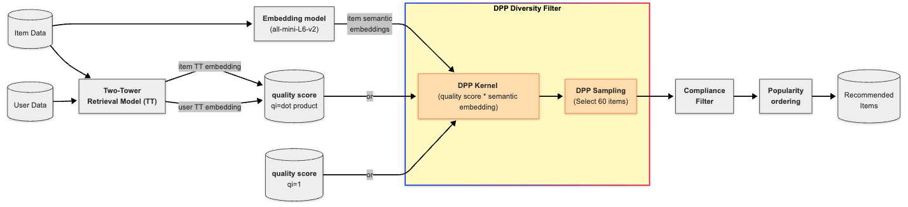

# DPP-Based Diversified Recommendation Demo

This repository contains demo code for the implementation of **Determinantal Point Process (DPP)** sampling in the *pass Culture* recommendation pipeline.

> 🔬 This code is a simplified demonstration of the approach used in our paper:  
> **"Diversified recommendations of cultural activities with personalized determinantal point processes"**  
> It is meant for educational and research purposes and does **not reflect the complexity of the production system** used in the actual pass Culture infrastructure.
> The production code can be found in these PRs: [PR with quality scores equal to two tower relevance score](https://github.com/pass-culture/data-gcp/pull/4074) and [PR with quality scores equal to 1](https://github.com/pass-culture/data-gcp/pull/4073)

---

## About the Project

In the pass Culture application, we aim to generate **diversified and personalized recommendations** of cultural activities (e.g., theater, books, concerts). While standard recommenders often prioritize only relevance, our method incorporates **diversity** using **Determinantal Point Processes (DPPs)**.

This demo shows how we integrated DPP into our recommendation pipeline illustrated in the following chart.



This demo simplifies the production pipeline focusing primarily on the DPP filter, the demo notebook shows the following steps: 
- Preparation of MovieLens data for the demo.
- Train a two tower retrieval model following the TFRS tutoriel. 
- We use the same DPP class as in the prodcution code to sample diversified recommendations. We use [`DPPy`](https://github.com/guilgautier/DPPy) library just like in production.
- Visualize the impact of DPP-based diversification on items recommended with and without the DPP filter. We also add the volume metric calculations like showed in the paper. 

---

## 📁 Repository Structure
```bash
├── images
│   └── pipeline_diagram.png
├── LICENSE
├── main.ipynb
├── pyproject.toml
├── README.md
└── uv.lock
```

## Getting Started

### Prerequisites
- To run the notebook locally, you can either download the notebook and independantly create an evironment with the dependecies to run the notebook.
- Alternatively, you can clone this repo, then in the cloned directory :
    - Install `uv`
    - Python == 3.10
    - Install dependencies: `uv sync`


## Running the Demo
Run the notebook `main.ipynb`

## Demo Overview
1. Prepare movieLens data
2. Create item embeddings with all-mini-L6-v2 embedding model from sentence-transformers
3. train a two tower retrieval model
4. Sample diverse recommendation sets using DPP
5. Compare top-k relevance-only selection with DPP-enhanced selection

## Reference
If you find this project useful in your work, please consider citing:

Diversified recommendations of cultural activities with personalized determinantal point processes
Authors: Carole Ibrahim, Hiba Bederina, Daniel Cuesta, Laurent Montier, Cyrille Delabre, Jill-Jênn Vie
Submitted to: RecSoGood
Year: 2025

## 💡 Notes
The production-grade implementation used at pass Culture is significantly more complex, integrating:
- APIs and feature stores
- Multi-stage recommender logic
- Real-time and batch environments

This demo focuses solely on the core DPP sampling logic for clarity and reproducibility.

## 📬 Contact
Feel free to reach out with questions or feedback via Issues or email.

## ⚖️ License: 
Mozilla Public License Version 2.0

## 🛠️ Maintainers: 
Carole Ibrahim, pass Culture
